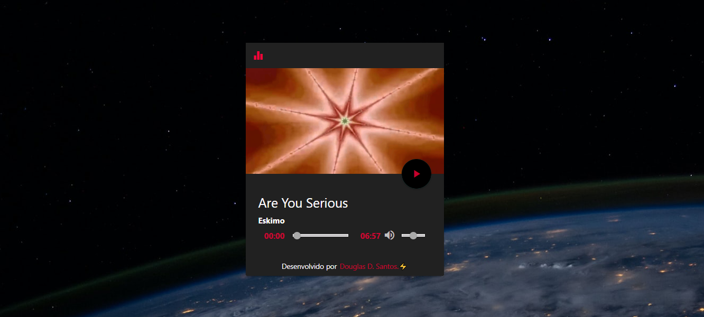

<h1 align="center">
     Music Player (em evolução)
</h1>

<h1>
    
</h1>   

<h3 align="center">

[?&style=for-the-badge&logo=gmail&logoColor=white)](mailto:douglas.d.santos.dev@gmail.com) [.svg?&style=for-the-badge&logo=linkedin&logoColor=white)](https://www.linkedin.com/in/douglas-santos-8442b41ba/)

</h3>

[Clique aqui para ver em ação](https://douglassantos-code.github.io/Music-Player/)

---

## 💻 Tecnologias utilizadas

- **HTML**
- **CSS**
- **Materials**
- **JavaScript**

---
## 🔥 Melhoria

Você pode adicionar a opção de selecionar vários álbuns.

Você pode adicionar botão de passar ou voltar de música.

---
## 📕 Licença

Esse projeto está sob a licença MIT. Veja o arquivo [LICENSE](https://github.com/DouglasSantos-code/Music-Player/blob/main/LICENSE) para mais detalhes.

---
Desenvolvido por ⚡ Douglas dos Santos.
